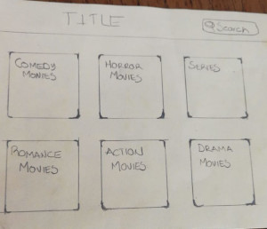
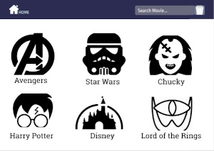

## Índice

* [1. Our Project](#Our-Project)
* [2. Low fidelity Prototypes](#2LOW-FIDELITY-PROTOTYPES)
* [3. High fidelity Prototypes](#HIGH-FIDELITY-PROTOTYPES)
* [4. Final Results](#4-FINAL-RESULTS)
* [4. Notes](#4-NOTES)

You can see this project at [LabMoovies](https://labmovies.web.app/).

## Our Project

This project was elaborated with "Create-React-App", in orders to create a website where users could find out information about their favorite movies like the public's acceptance or rejection rating and movie trailers, as well as streaming. Our site has a search option to find your favorite movie, also you can se the categories is case you don't know "What you want to see" yet. Finally we have the display of the films and their information.

### LOW FIDELITY PROTOTYPES

Since the beginning the project was planned for users who wanted to know the recommendations of other users about the movies. This is the reason, our low-fidelity prototypes are like this.

### HIGH FIDELITY PROTOTYPES

Trying to build this on our low fidelity prototypes, we created our "high fidelity" prototypes, with the color palette we chose and the implementation of improvements.

### FINAL RESULTS

Once we finish the construction of our site, and trying to stick as well as possible to our high-fidelity prototypes, the result is presented below.

### NOTES:

This project was created with the collaboration of 4 women, in a period of 3 days. In that time the project was presented to us, we created the planning, we specified development times, we divided tasks and established rules.
The purpose was to test ourselves to realize the skills acquired and improved as developers. If you want to know their work, below I present their GutHub profiles.

* [Bianca Cardona](https://github.com/Biancardona)
* [Brenda Sandoval](https://github.com/Sahory31)
* [Itzá Carrillo](https://github.com/ItzaCarrillo)
* [Yaidi García](https://github.com/Yaidi)
